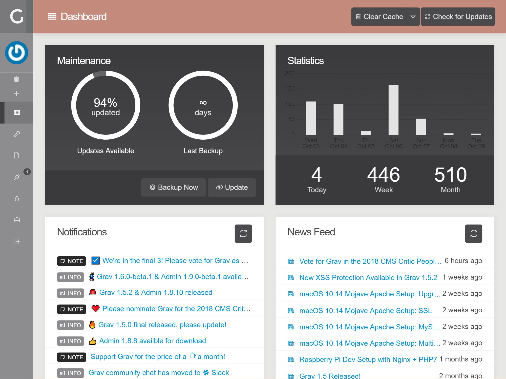
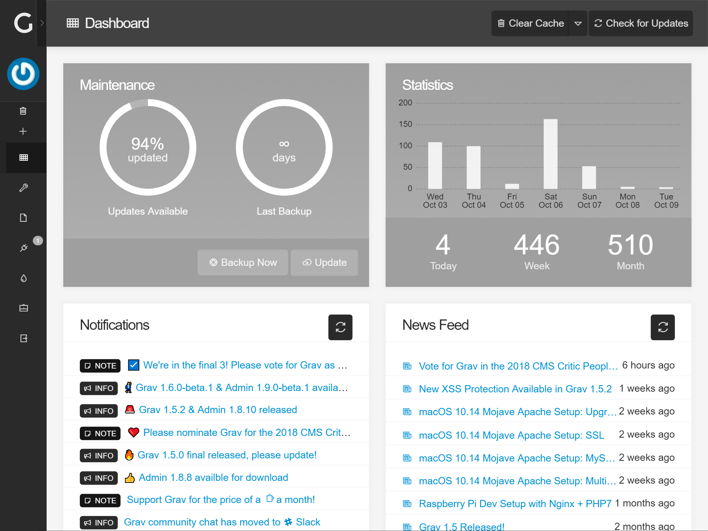
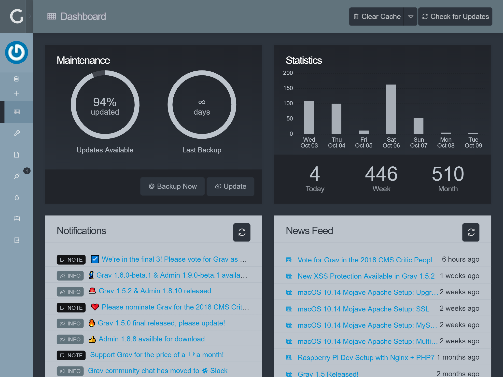
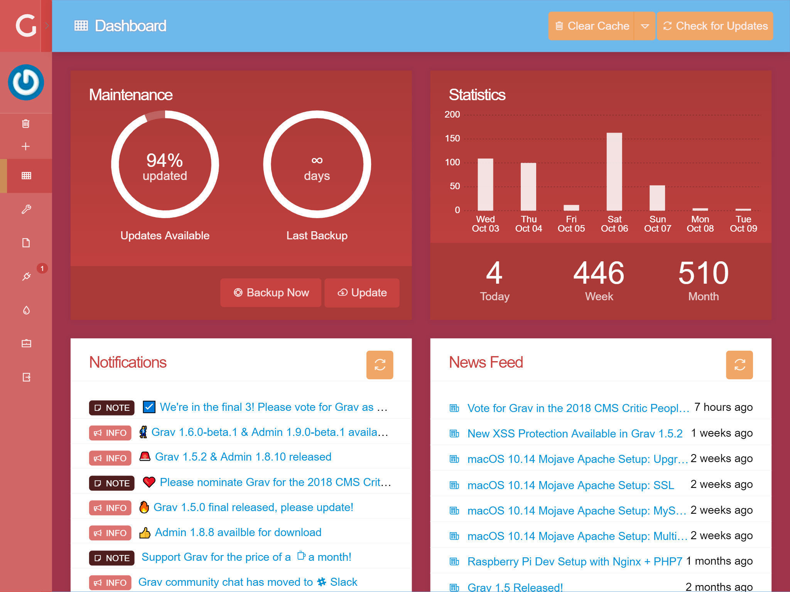
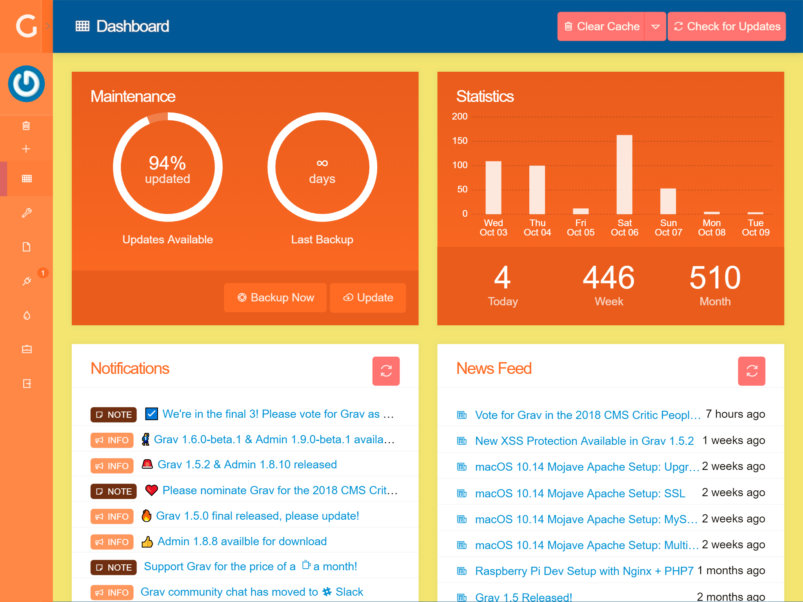
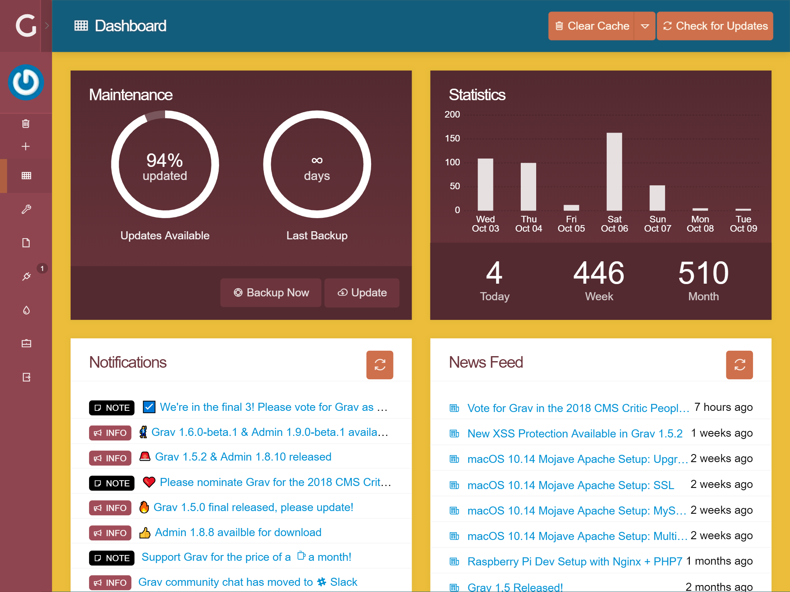
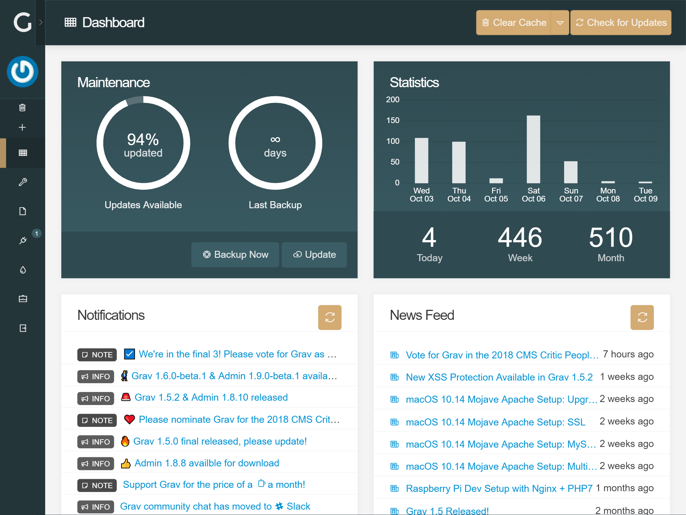
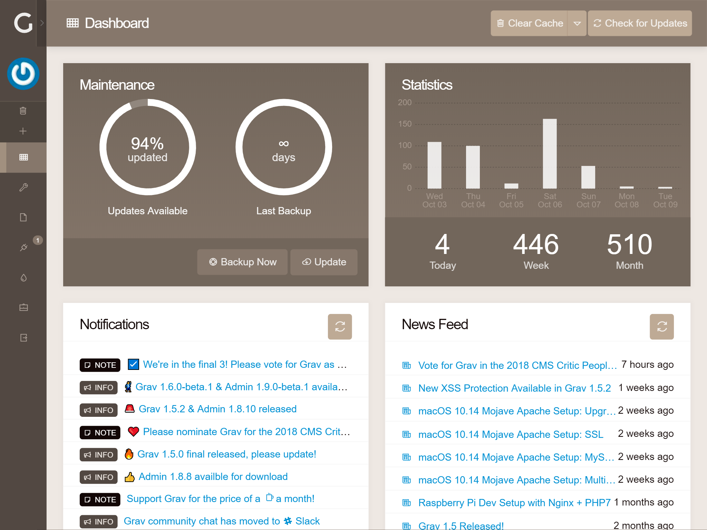
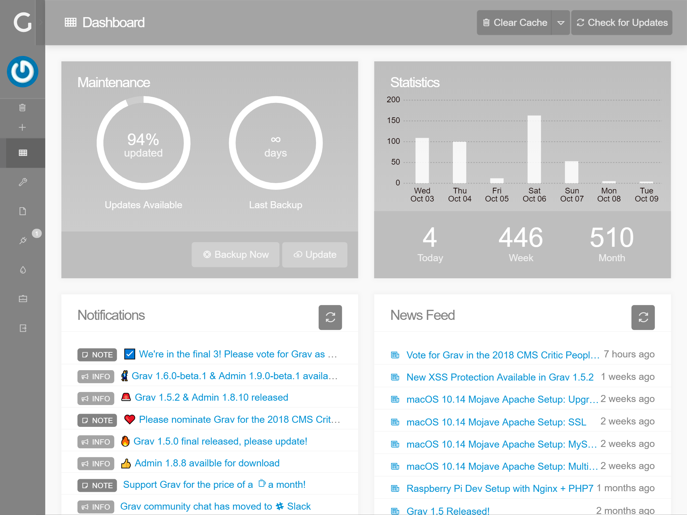
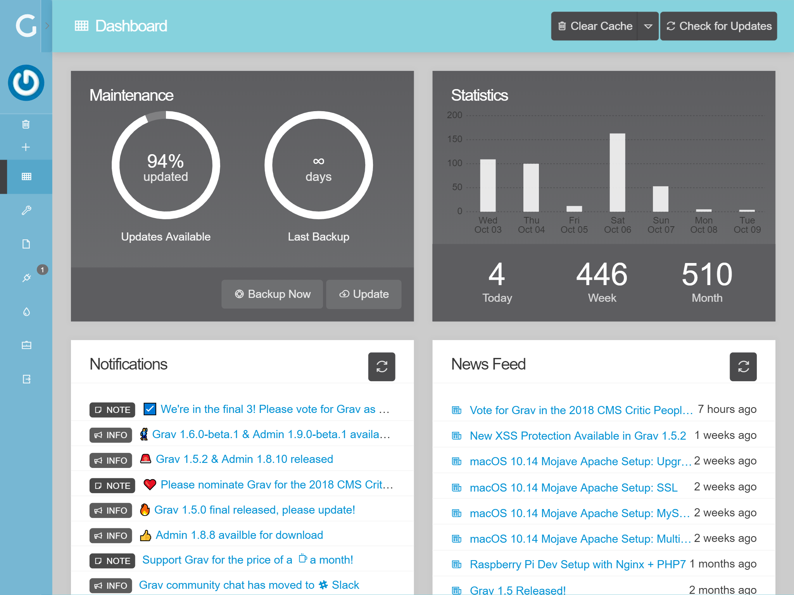

# [Grav](http://getgrav.org/) Admin Styles Plugin

Adds a variety of custom styles to the [Admin-plugin](https://github.com/getgrav/grav-plugin-admin/), by injecting CSS-files which override the default. All styles are based on the default style for the Admin-plugin, but do not altar it.

All styles are generated from Sass/SCSS, and the compiled files are compressed and the corresponding `.map.css`-files included.

# Installation and Configuration

1. Download the zip version of [this repository](https://github.com/OleVik/grav-plugin-adminstyles) and unzip it under `/your/site/grav/user/plugins`.
2. Rename the folder to `adminstyles`.

You should now have all the plugin files under

    /your/site/grav/user/plugins/adminstyles

The plugin is enabled by default, and can be disabled by copying `user/plugins/adminstyles/adminstyles.yaml` into `user/config/plugins/adminstyles.yaml` and setting `enabled: false`.

## Selecting a style
Styles can manually be selected from the `styles`-list in `user/plugins/adminstyles/adminstyles.yaml`, and activated by setting `current: STYLE` in `user/config/plugins/adminstyles.yaml`.

The visual configuration - in `admin/plugins/adminstyles` - allows you to select a preferred style by clicking the corresponding image. The image will become blurry with a large green checkmark overlapping it, indicating that the style is selected. Now just click the "Save"-button in the top-right corner, and the style will be active.

### Available styles

#### Default

#### Metal

#### Light

#### Stark Contrast

#### Dark Ocean

#### Wine

#### Beach

#### Muted Beach

#### Sunrise

#### Navy Sunrise

#### Tan

#### Grey

#### Gold

#### Arctic

#### Amber

#### Antique

## Creating your own style

Since version 2.0.0 the plugin allows you to create your own styles from the Admin-interface, without much effort. Simply go to the plugin's settings-page, `/admin/plugins/adminstyles`, then click the *Custom*-tag and play around with the colors. Once set, go to the *Compile*-tab and click the button corresponding the name you gave your style.

Compilation is equivalent to how the default themes are created, as specified below, and will be slower than using a native compiler on your own system. Once compiled, the style will be available from the *Options*-tab.

### Un-FAQ

* **Why is there no live preview when creating a style?** Compilation requires resource that should not be utilized in this manner, if you want live previews see [Development](#development) below.

## Development

The color schemes follow the style and design of the native [Admin-plugin](https://github.com/getgrav/grav-plugin-admin) **closely**, and as a rule only override base colors, and specific elements' appearence when necessary to maintain this design. For example, the default [Metal](https://github.com/OleVik/grav-plugin-adminstyles/blob/master/styles/scss/metal.scss)-scheme imports the base elements from Admin (copied between versions from [scss/](https://github.com/getgrav/grav-plugin-admin/tree/develop/themes/grav/scss) to [base/]/(https://github.com/OleVik/grav-plugin-adminstyles/tree/master/styles/scss/base)), overrides Sass-variables, and imports [Preset.scss](https://github.com/getgrav/grav-plugin-admin/blob/develop/themes/grav/scss/preset.scss) to change the colors.

To recompile styles using a Sass-compiler, run it on /scss and output to /css, like `node-sass --watch --source-map true styles/scss/ --output styles/css/`.

MIT License 2018 by [Ole Vik](http://github.com/olevik).

### Contributing

Made an exceptionally impressive color scheme that warrants inclusion in the plugin? Create a [Pull Request](https://github.com/OleVik/grav-plugin-adminstyles/pulls) and include the settings from `user/config/plugins/adminstyles.yaml`, as well as a 1500x625px picture to go with it (mainly showing off the colors), and it will be reviewed the the plugin author and possibly included with future releases.

## TODO

- [ ] Per user style
- [ ] Revisit theme preview page