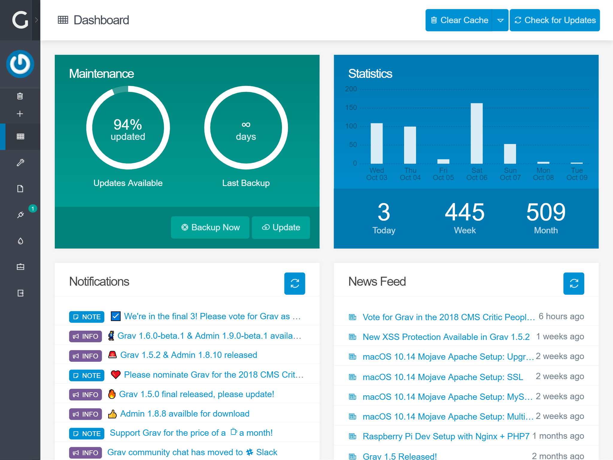
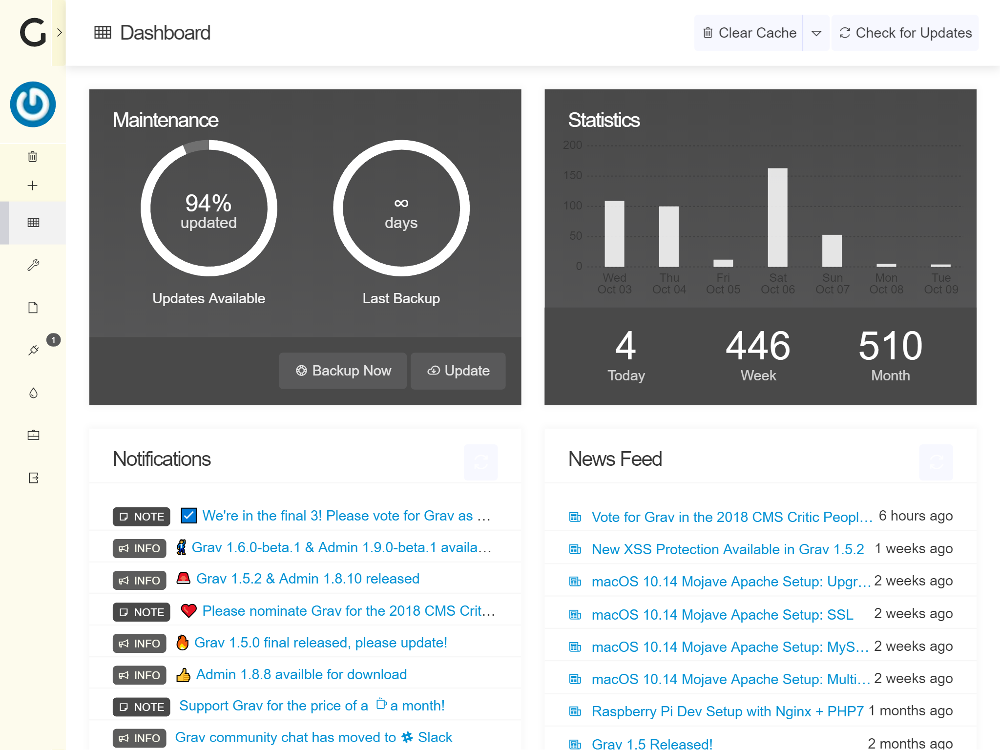
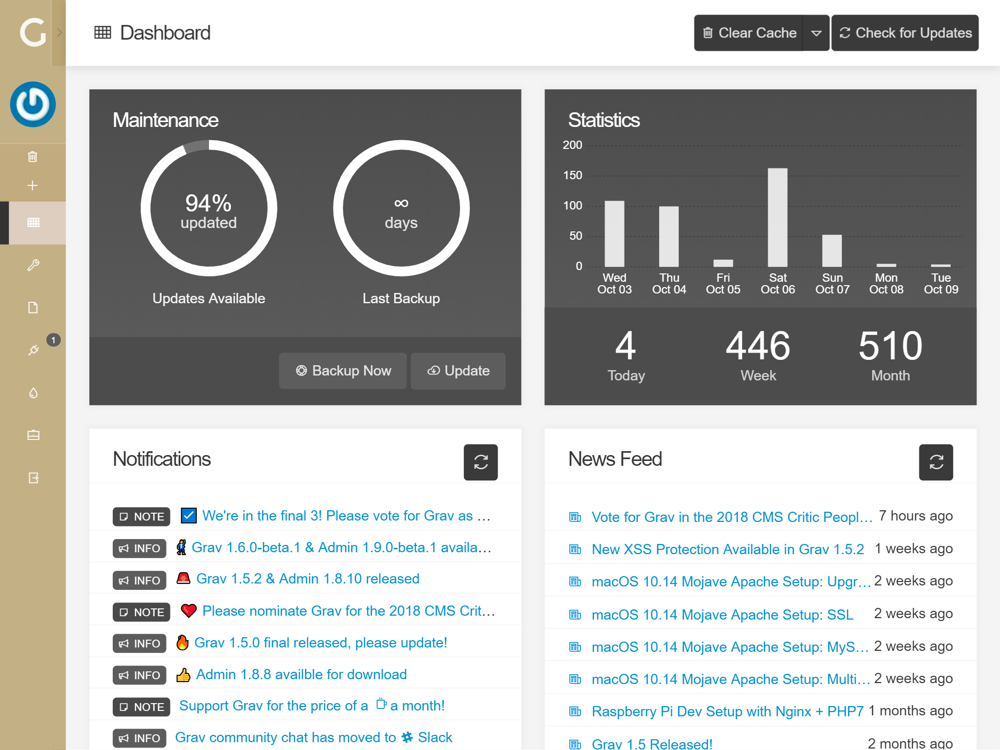
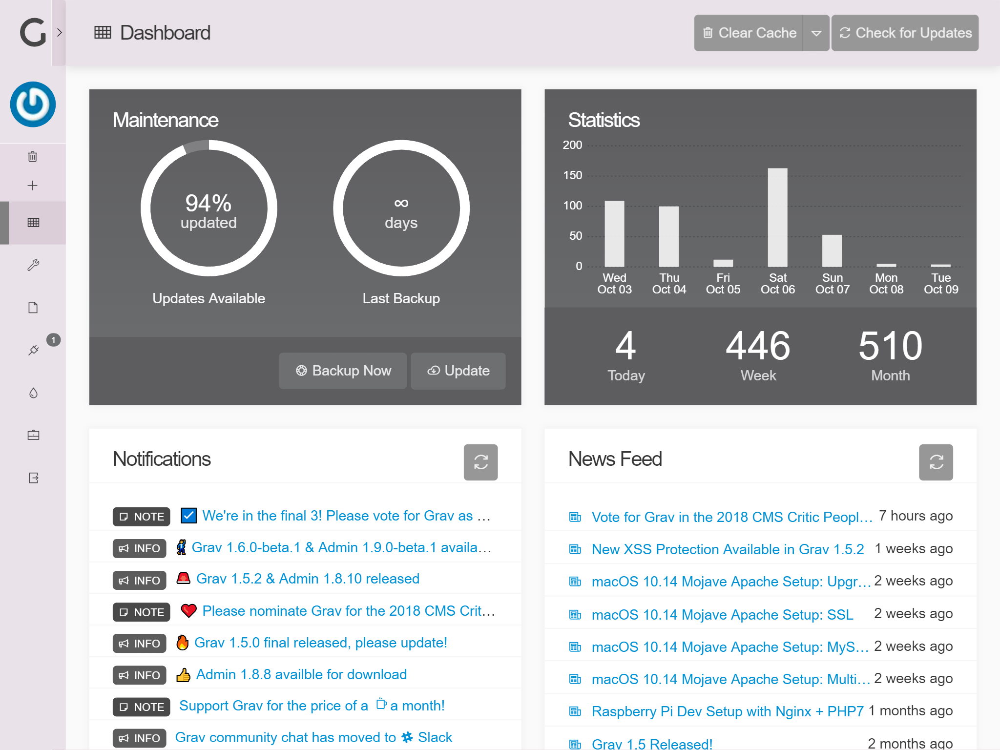
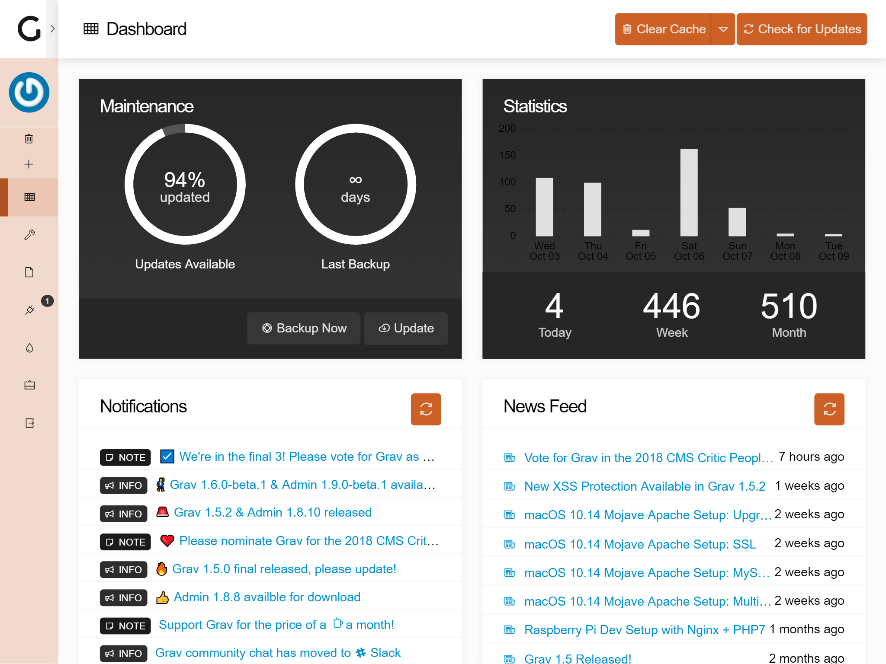

# [Grav](http://getgrav.org/) Admin Styles Plugin

Adds a variety of custom styles to the [Admin-plugin](https://github.com/getgrav/grav-plugin-admin/), by injecting CSS-files which override the default. All styles are based on the default style for the Admin-plugin, but do not altar it.

All styles are generated from Sass/SCSS, and the compiled files are compressed and the corresponding `.map.css`-files included.

# Installation and Configuration

1. Download the zip version of [this repository](https://github.com/OleVik/grav-plugin-adminstyles) and unzip it under `/your/site/grav/user/plugins`.
2. Rename the folder to `adminstyles`.

You should now have all the plugin files under

    /your/site/grav/user/plugins/adminstyles

The plugin is enabled by default, and can be disabled by copying `user/plugins/adminstyles/adminstyles.yaml` into `user/config/plugins/adminstyles.yaml` and setting `enabled: false`.

## Selecting a style
Styles can manually be selected from the `styles`-list in `user/plugins/adminstyles/adminstyles.yaml`, and activated by setting `current: STYLE` in `user/config/plugins/adminstyles.yaml`.

The visual configuration - in `admin/plugins/adminstyles` - allows you to select a preferred style by clicking the corresponding image. The image will become blurry with a large green checkmark overlapping it, indicating that the style is selected. Now just click the "Save"-button in the top-right corner, and the style will be active.

### Available styles

#### Default

#### Metal

#### Light

#### Stark Contrast

#### Tan

#### Grey

#### Gold

#### Navy Sunrise

#### Antique

#### Arctic

#### Amber

MIT License 2017 by [Ole Vik](http://github.com/olevik).